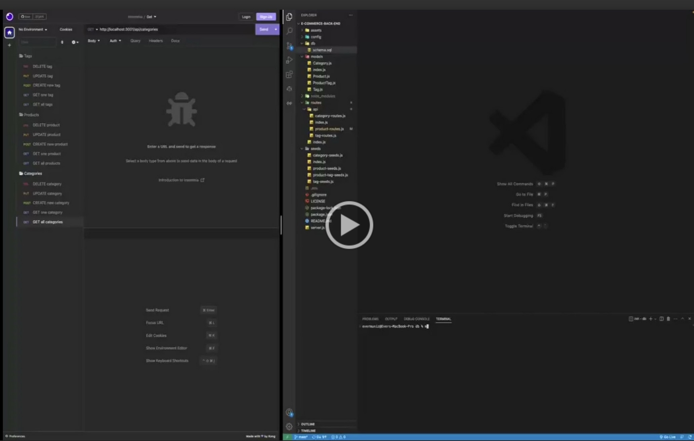

# E-Commerce Back End
 

## Description

This application manages data on the back end for an e-commerce business. By using an Express.js API, it will connect to a database using Sequelize to make HTTP GET, PUT, POST, PUT, and DELETE requests. I learned how to tie multiple tables together in mysql and how to manage their associations. I also learned how to integrate API routes with Sequelize models. Additionally, the application connects to the db using environment variables.   

## Table of Contents (Optional)

- [Usage](#usage)
- [Credits](#credits)
- [License](#license)

## Usage
You will need dotenv, express, mysql2, and sequelize to run this code. To install the dependencies run <mark>npm i</mark> in the command terminal. From the db folder, run <mark>mysql -uroot</mark> followed by <mark>source schema.sql</mark> to create the db. To seed the db open a terminal from the root and run <mark>node seeds/index.js.</mark> Now you are ready to begin the application. Run <mark>node server.js</mark> to begin the application on your local server. I would recommend using Insomnia or a similar tool to explore the routes and HTTP requests possible.These are GET, PUT, POST, and DELETE for all or individual categories, products, and tags. Click on the thumbnail below to view examples of these. 

## Credits
- Node.js
- Express.js
- MySQL and MySQL2 
- Sequelize
- References and starter code provided by the University of Utah Coding Bootcamp

## License
This project is licensed under the MIT license.

## How to Contribute

Please visit the [Contributor Covenant](https://www.contributor-covenant.org/)

  ## Questions

  If you have any questions, please contact me at evermuniz@outlook.com.
  You can also visit my GitHub profile [here](https://github.com/evermuniz/)